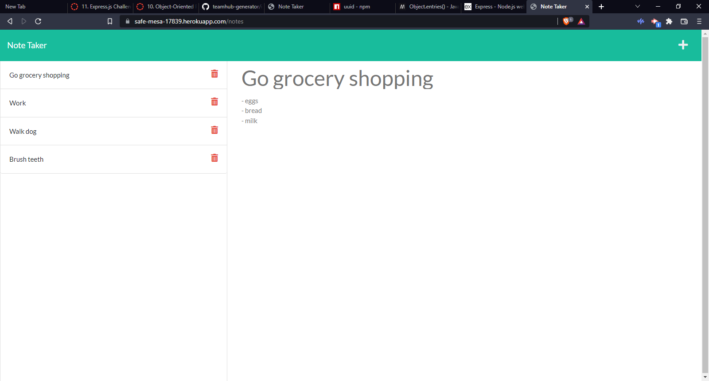

# note-taker

## Table of Contents
* [Description](#Description)
* [Installation](#Installation)
* [Usage](#Usage)
* [Questions](#Questions)
* [Credits](#Credits)

## Description
Note Taker is an application designed to help users store notes in an easy-to-use interface to be accessed at a later time. The languages used to build this application are JavaScript, ES6, Node.js, and Express.js. 

## Usage
First, select "Get Started" to enter the notes section. Users can add, save, and delete notes as desired.

## Installation
No installation, access the application via the live Heroku URL: https://safe-mesa-17839.herokuapp.com/
## Questions
If you have any questions about this project, please contact me via my GitHub: https://github.com/garretthilberling

## Credits
This project was created solely by Garrett Hilberling: https://www.linkedin.com/in/garretthilberling/
    
